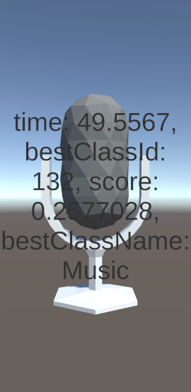

# YAMNet Unity Demo

This is prediction demo of 
[TensorFlow YamNet model](https://www.tensorflow.org/hub/tutorials/yamnet)
on Unity Barracuda.
YAMNet is a deep net that predicts 521 audio event classes from the AudioSet-YouTube
corpus it was trained on. It employs the Mobilenet_v1 depthwise-separable convolution architecture.

The original YAMNet is composed of mel-scaled spectrogram transform and Mobilenet_v1. Because Barracuda doesn't
support mel-scaled spectrogram transform. The included ONNX file only contains Moblenet_v1 and 
mel-scaled spectrogram transform is implemented by C#.

